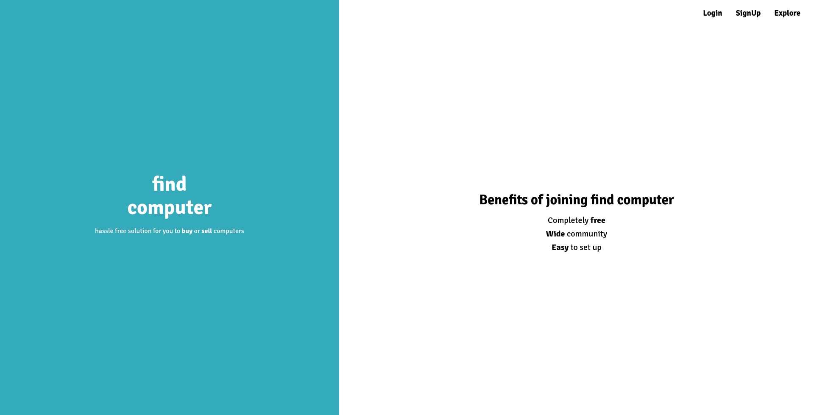
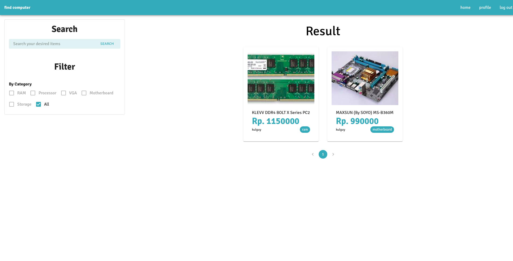
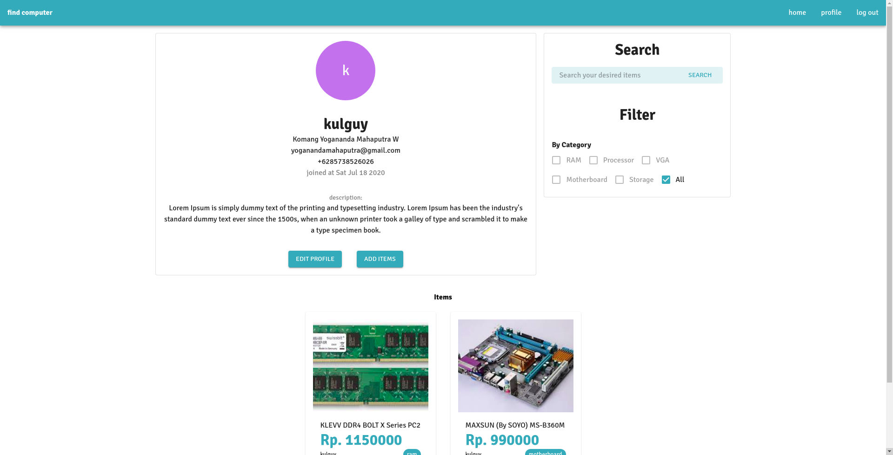
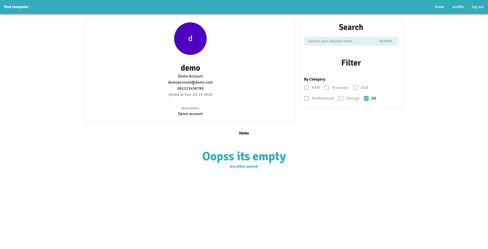
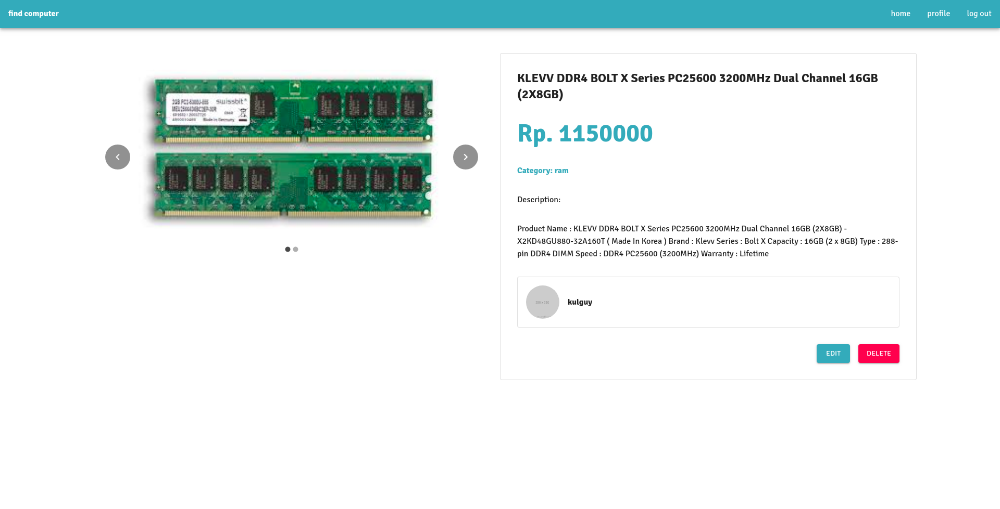
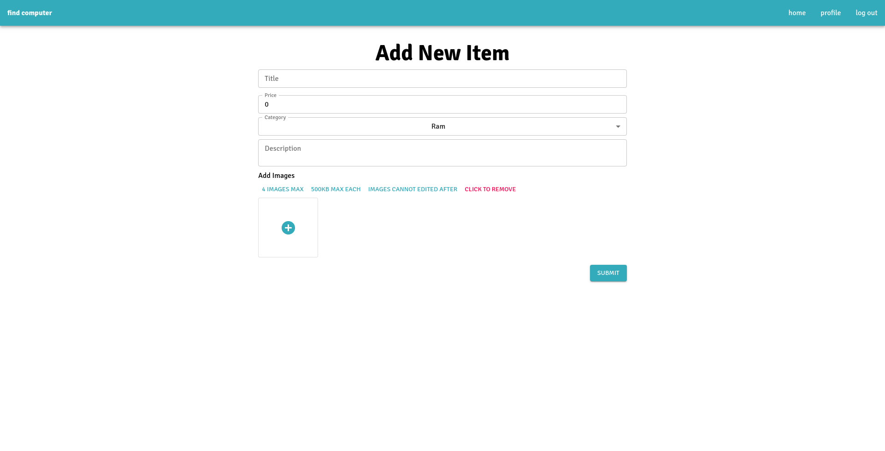

# Daftar isi
- [Daftar isi](#daftar-isi)
- [Find Computer FrontEnd](#find-computer-frontend)
  - [Deskripsi](#deskripsi)
  - [Route](#route)
- [Local Deployment](#local-deployment)
  - [Environtment](#environtment)
  - [Environtment variable](#environtment-variable)
- [Run](#run)
  
# Find Computer FrontEnd

## Deskripsi
Find Computer frontend dikerjakan dengan menggunakan library ReactJS dengan menggunakan Typescript. Frontend menggunakan authentikasi JWT untuk setiap requestnya (terutama request yang memerlukan authentikasi). JWT Token disimpan didalam localstorage sehingga user tidak perlu login setiap refresh page.

## Route
Halaman yang tersedia pada front end adalah  
1. /  
   Halaman landing page, login dan signup.  
   
2. /explore  
   Halaman yang menampilkan semua produk yang ada.  
   
3. /account/me  
   Halaman yang menampilkanm dan mengedit informasi dirinya  
   
4. /account/:username  
   Halaman yang menampilkan informasi pengguna dan itemnya  
   
5. /item/details/:id  
   Halaman yang menampilkan informasi detail barang dan aksi yang dilakukan (beli, edit, hapus)  
   
6. /item/add  
   Halaman untuk menambahkan item baru  
   

# Local Deployment

  ## Environtment
  - Proyek ini menggunakan yarn package manager. Install apabila belum memiliki yarn package manager sesuai instruksi [ini](https://yarnpkg.com/getting-started/install)
  - Jalankan perintah
    ```bash
    yarn install
    ```

  ## Environtment variable
  - Buka .env.development
  - Ubahlah ```REACT_APP_BASE_URL=http://localhost:5000``` sesuai dengan alamat dari module backend

# Run
Jalankan project dengan perintah
```bash
yarn start
```